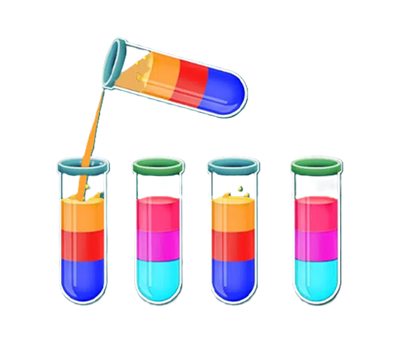

# Water Color Sort-GAMES 🎮

لعبة ذكاء وتركيز تقوم على مبدأ فرز الألوان داخل أنابيب الاختبار.

## 🎯 فكرة اللعبة
مهمتك هي وضع السوائل ذات اللون نفسه في نفس الأنبوب.  
يمكنك نقل السائل إلى أنبوب آخر بشرط أن:
- يكون الأنبوب الآخر فارغًا، أو
- يحتوي في الأعلى على نفس لون السائل المنقول.

## 🕹️ المستويات
اللعبة تحتوي على مستويات مختلفة:
- سهل (Easy)
- متوسط (Medium)
- صعب (Hard)
- صعب جدًا (Very Hard)
- مستحيل (Impossible)

---
## 📸 معاينة

لقطة متحركة توضح طريقة اللعب:

---

## 📝 ⚖️الرخصة

تم نشر هذا المشروع بموجب رخصة **[MPL-2.0](LICENSE)**.

---

## 🙌 المساهمة

نرحب بجميع المساهمات! لا تتردد في فتح **issue** أو إرسال **pull request** لتطوير اللعبة وتحسينها.

---

